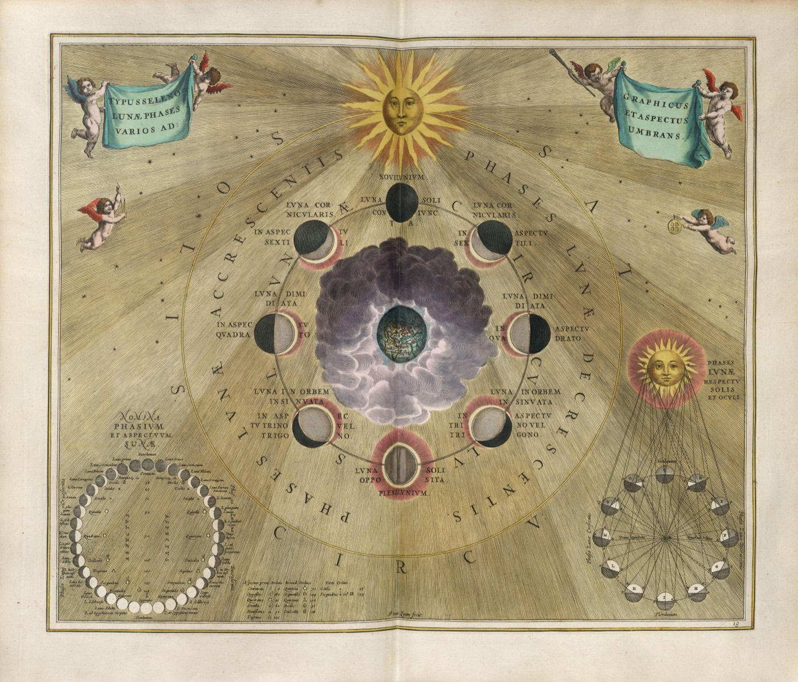

<p align="center">
  
</p>

# nocturne

**A self-improving, sleep-time research agent that rewrites what it knows *and* how it thinks — overnight — and gets measurably better at being you each night.**

> Two-level sleep-time compute: the same structured-rewrite primitive (`add` / `merge` / `reweight` / `drop`) runs on **episodic memory** (what I know) *and* on the agent's **own operating policy** (how I decide what's worth knowing).

**CS 153 — The One-Person Frontier Lab (final project).** Author: **Harsh Singh** · Track: **Automation / Agent Systems** · Repo: <https://github.com/singhh5050/nocturne>

---

## Grader's map to the 15-point rubric

Everything the rubric asks for, and exactly where to find it. The single best artifact to open first is **`artifacts/dashboard.html`** (double-click it — no server, no network) and scrub the 30 nights.

| Rubric dimension | Where it lives | One-line summary |
|---|---|---|
| **Problem & Insight (3)** | [§ Why](#why--problem--insight), [§ The motif](#the-motif--a-constellation-is-meaning-drawn-from-chaos) | A bounded *working memory* for agents — the inverse of never-forget libraries like GBrain. One rewrite primitive at **two levels** (memory + policy) is the novel move. |
| **Execution & Technical Work (5)** | [§ How it works](#how-it-works), `src/nocturne/`, `artifacts/dashboard.html`, git history | Full system: shared rewrite engine, decaying bounded memory + self-rewritten policy, sleep stages (triage→consolidate→REM), a confidence-scored hypothesis ledger, a validation-gated self-improvement loop, a 4-arm eval harness, **real tiered inference on DigitalOcean**, and a self-contained time-machine dashboard. |
| **Evaluation & Evidence (3)** | [§ Results](#results), `results.md`, `runs/batch/`, [§ Limitations](#limitations--failure-analysis) | 4 memory strategies + ablations, **5 seeds**, store-vs-query fairness so the library arm isn't strawmanned, needle-survival F1, morning-QA accuracy, the self-improvement curve, the confirmed planted insight, and an honest failure analysis. |
| **Communication & Presentation (2)** | This README, the dashboard, the demo video | Rubric-mapped README, a beautiful interactive dashboard, and a <10-min demo. Reproducible from a single command. |
| **Process, Integrity & Disclosure (2)** | [§ AI usage](#ai-usage-disclosure), [§ Data](#data-methods-note--please-read), [§ Citations](#citations--acknowledgements), public commit history | AI use disclosed, the dataset disclosed as simulated, GBrain cited honestly (we read its source and do **not** claim to beat it), prior work cited, and a granular public commit history. |

**Video question map:** **Q1 (why)** → [§ Why](#why--problem--insight) · **Q2 (how)** → [§ How it works](#how-it-works) · **Q3 (use cases / impact)** → [§ Use cases & impact](#use-cases--impact) · **Q4 (what more)** → [§ Roadmap](#roadmap).

---

## TL;DR

While you sleep, nocturne pulls your day's signals (papers, mail, calendar, Slack, GitHub, notes), and instead of *appending* everything to an ever-growing store, it **consolidates** a small, bounded working memory: merging evidence, reconciling contradictions, forgetting what's resolved, and surfacing latent cross-thread insights. Each morning it grades its own briefing against what actually mattered and **rewrites its own policy** so tomorrow's consolidation is sharper.

nocturne is not a competitor to a knowledge base like **GBrain** — it's the missing **working-memory / executive layer** that sits *on top* of one. GBrain-style systems are long-term memory: never forget, retrieve-and-synthesize on demand, and (by their own design) *surface* conflicting facts for you to resolve. nocturne is the bounded layer that holds only what matters for *tomorrow*, **reconciles** contradictions to a single current truth, acts **proactively** (a morning briefing, with no query), and **rewrites its own policy** from feedback.

The central question we test: **for a daily working set, does bounded consolidation + reconciliation beat accumulation?** We compare against a faithful, retrieval-based GBrain analog and find a clean, *fair* result: ours keeps a tiny store, **synthesizes a cross-thread insight** that never appears in any single item, **self-improves** over the month — while accumulation wins long-tail recall (the trade we deliberately make).

---

## Why — problem & insight

Most agent "memory" appends. **GBrain** (Garry Tan / YC, open-sourced Apr 2026) is the flagship of that bet: a never-forget, markdown-first, self-wiring knowledge graph; its production instance holds 146k+ pages, and it answers by **retrieving the top ~20–40 relevant pages and synthesizing** a cited answer. We read its source to be fair to it — it is a genuinely strong long-term-memory system, and we do **not** claim to beat it at what it's for.

nocturne asks a different question and occupies a different layer: **"what is the *smallest* memory that still makes me effective tomorrow?"** Working memory, not a library. Four things follow that GBrain by design does *not* do — confirmed from its code:

| | GBrain (long-term memory) | nocturne (working memory) |
|---|---|---|
| Footprint | never forget (146k+ pages) | bounded under a hard token budget; active forgetting (`drop` + decay) |
| Contradictions | *surfaces both* ("never silently pick one") | **reconciles** to the current truth (drops the stale one) |
| Interaction | **pull** — you query it | **push** — proactive briefing, no query |
| Adaptation | fixed pipeline | **rewrites its own operating policy** from graded feedback |

These aren't "a worse GBrain" — they're a different organ (working memory + executive function vs. long-term store), and they're **complementary**: nocturne is exactly the kind of bounded layer that could sit on top of a GBrain library (see [Roadmap](#roadmap)). We build on **sleep-time compute** (Lin et al., arXiv:2504.13171) and **Reflexion** (arXiv:2303.11366); the novel move is one rewrite primitive at *two levels* (memory + policy) plus reconciliation and proactivity.

---

## The motif — a constellation is meaning drawn from chaos

The project is *inspired by* **baroque celestial cartography** — Andreas Cellarius's *Harmonia Macrocosmica* (1660) and the era's star atlases — because that period's idea **is** the thesis, not decoration. The night sky is an overwhelming field of stars (the raw signal stream). The astronomer working *through the night* doesn't catalog every star; they draw a few **constellations**: bounded, meaningful figures you steer by, remembered and passed down.

<p align="center">
  <br>
  <sub><i>Andreas Cellarius, “Typus Selenes — the varying phases and appearances of the Moon,”</i> Harmonia Macrocosmica <i>(1660), public domain. Shown as the historical inspiration only — every visual in the app itself is our own, drawn in code.</i></sub>
</p>

That is the difference nocturne draws out: **GBrain is the star *catalog*** — every point of light kept, retrievable. **nocturne is the *constellation*** — the small figure you actually navigate by, charted overnight, with faint unmentioned stars allowed to fade. The dashboard's "two brains" panel makes it literal: a connected gold constellation beside an ever-denser blue catalog. We borrow the *period*, not its images — **every visual element is our own, made in code**: a real-time **WebGL nebula**, procedural SVG constellations and star fields, gold hairlines, and Fraunces type. Nothing in the app is a pasted artwork.

---

## How it works

### The primitive, at two levels

```
            ┌──────────────────────────────────────────────────────────┐
            │            structured rewrite ops                         │
            │      add · merge · reweight · drop  (src/nocturne/ops.py) │
            └───────────────┬───────────────────────┬──────────────────┘
                            │                        │
                  Level 1: memory            Level 2: policy
              (what I know)              (how I decide what to keep)
              MemoryStore                PolicyStore
              bounded · decays           directives the agent
              · provenance · budget      writes for its future self
```

`ops.py` is shared by both `MemoryStore` and `PolicyStore` — "one primitive, two levels" is literally true in the code, not a metaphor.

### A night, end to end

```
 sources ─▶ LIGHT (triage) ─▶ DEEP (consolidate: merge/reweight/drop) ─▶ REM (cross-thread synthesis)
                                        │                                      │
                                  bounded memory                       hypothesis ledger
                                        │                                      │
 morning ─▶ proactive briefing  ◀───────┴──────────────────────────────────────┘
        ─▶ judge vs ground truth ─▶ critique ─▶ SELF-IMPROVE (rewrite the policy)
                                                   validation-gated hill-climb (keep-best + rollback)
```

Key mechanisms (all in `src/nocturne/`): **provenance** (every memory item links to the raw items that produced it), a **hard token budget** that forces real tradeoffs, **Ebbinghaus decay + reinforcement**, **conflict reconciliation**, a confidence-scored **hypothesis ledger** (REM promotes an insight only when confirming evidence arrives), and **proactive briefings**.

### Tiered models — effort matched to cognitive load, like a brain

The stages aren't equally hard, so we don't pay for them equally. A small, fast **`gpt-oss-20b`** handles the routine triage and consolidation; a far larger **`gpt-oss-120b`** is reserved for the **REM** stage, where the hard, creative cross-thread synthesis happens. Same idea as sleep: cheap maintenance most of the night, expensive synthesis in short bursts.

---

## Data (methods note — please read)

The 30-day stream is a **simulated environment**, not a real inbox. We built a story-shaped, **ground-truth-labeled** life-stream generator (`src/nocturne/sim/`) so the system is reproducible and testable at a scale that would take a month to collect live. The labels (which item is a needle, which thread it belongs to, which is noise) are authored from the skeleton script **independently of the item bodies**, which keeps the evaluation non-circular.

**The inputs are simulated; the cognition is real.** Every consolidation, reconciliation, REM synthesis, self-improvement edit, and QA answer is produced by a real model via the **DigitalOcean** inference API — all arms see the identical stream, so results turn on real reasoning, not authored endings. The trace is frozen at `src/nocturne/sim/traces/world_30d.json`.

The trace encodes deliberate shapes: a rebuttal spine (stays hot), a collaboration that fizzles (must fade), a recurring paper-saving habit (must be inferred as a preference), pure noise (must be ignored), and a **planted latent insight** — a consolidation paper on night 6 + an experiment anomaly on night 13 → a synthesis the agent should surface ("accumulation is the problem; bounded consolidation is the fix"), confirmed by new data on night 22.

---

## Results

Run on **DigitalOcean serverless inference** — tiered **gpt-oss-20b** (bulk cycles) + **gpt-oss-120b** (REM synthesis) — over the 30-night trace, **5 seeds** (mean±std). The committed `runs/run.json`, `runs/batch/`, `results.md`, and `artifacts/*.png` are this real run (not a stand-in). Full per-seed numbers: `runs/batch/summary.json`.

**A fair comparison.** We separate two costs so we don't strawman the library: **store** (everything an arm holds) vs **query** (the context actually used to answer). The GBrain arm keeps everything *and* answers by **retrieving the top-K relevant pages** — so its query cost is bounded, exactly like the real system. We do not claim a query-token win.

| arm | store | needle F1 | noise in memory | morning-QA |
|---|---|---|---|---|
| **rewrite (ours)** | **~325 tok** (flat) | **0.64 ± 0.10** | **0** | 0.87 ± 0.07 |
| gbrain_accumulate (retrieval) | ~12k tok, grows | 0.02 | 300 | 1.00 |
| naive append | ~12k tok, grows | 0.02 | 300 | 0.83 |
| sliding window | ~1.5k tok | 0.09 | 40 | 0.67 |

**What actually differs (the fair wins):**
1. **Cross-thread synthesis.** Overnight the REM pass connects a paper (night 6) with an experiment anomaly (night 13) — never linked in any single item — into a confirmed insight (night 22). Over the month it builds a 43-entry **hypothesis ledger** (≈16 confirmed): connecting a reviewer's demand to a paper as the missing baseline, doing compute-vs-deadline arithmetic, and even turning the reviewer's critique *against its own paper* into a testable ablation. None of it is scripted.
2. **It stores conclusions, not inputs.** By week three its top memory item (full weight) is a sentence it *wrote itself* — "consolidation reduces cross-fact interference; rewrite beats naive append by ~9 F1" — while the raw papers and emails it came from have decayed to ~0.
3. **Self-improvement.** Best-so-far composite score **0.67 ± 0.07** vs a static policy **0.29 ± 0.16** — the agent teaches itself directives (e.g. drop promotional mail, retain deadlines) that a fixed pipeline has no mechanism for.
4. **Compact, self-curating store** (zero retained noise) and a **proactive** morning briefing with no query.

**Where accumulation wins (the trade we make):** long-tail recall of arbitrary old facts. nocturne deliberately forgets to stay sharp; that's the bet.

Charts (committed to `artifacts/`):


### The time-machine dashboard

`artifacts/dashboard.html` is a **single self-contained file** (no server, no network) — scrub all 30 nights and watch the memory **constellation**, the morning briefing, the hypothesis ledger (open → confirmed), the self-rewritten policy, the "two brains" comparison, and the eval charts evolve. Click any star to see its provenance — the raw items it was built from. Just open it in a browser.

---

## Quickstart

```bash
python3.11 -m venv .venv && source .venv/bin/activate     # or: uv venv
pip install -e ".[dev]"                                    # or: uv pip install -e ".[dev]"

# 1) zero setup — open the committed real run; no key, no network
open artifacts/dashboard.html

# 2) deterministic test suite (no network)
pytest -q

# 3) watch the pipeline run end-to-end with NO key (transparent heuristic engine; not the model)
python -m nocturne.run demo --nights 12 --offline

# 4) reproduce the real numbers on DigitalOcean inference (OpenAI-compatible)
cp .env.example .env        # set OPENAI_BASE_URL / OPENAI_API_KEY / OPENAI_MODEL / OPENAI_REM_MODEL
python -m nocturne.run eval --do        # single run -> run.json + charts + dashboard
python -m nocturne.run batch --do       # 5 seeds + ablations -> runs/batch/summary.json
```

Engines: `--do` (real DigitalOcean model) · `--offline` (transparent deterministic heuristic for a zero-key functional check + tests — explicitly *not* the model; see [Limitations](#limitations--failure-analysis)). Re-running `eval`/`batch` overwrites the committed artifacts with your fresh run.

---

## Repository layout

```
src/nocturne/
  ops.py            shared rewrite primitive (add/merge/reweight/drop) — used by both stores
  memory/           MemoryStore (provenance, token budget, conflict) + decay.py (Ebbinghaus)
  policy/           PolicyStore — the self-rewritten operating policy
  agent/            prompts, rewrite (deep consolidate), rem, improve, qa, baselines
  hypotheses/       confidence-scored insight ledger
  sim/              the simulation environment + frozen world_30d.json (DATA)
  eval/             metrics, judge, harness (both experiments), batch, report
  viz/              matplotlib charts + the self-contained dashboard (+ assets/ fonts)
  openai_compat.py  DigitalOcean (OpenAI-compatible) engine
  llm.py            Anthropic engine (optional) + caching + record/replay
  offline.py        deterministic heuristic engine (no key) for tests + quick checks
  run.py            CLI: sim | eval | demo | batch | dashboard
tests/              deterministic FakeLLM end-to-end + unit tests
artifacts/          committed charts + dashboard.html (the real DO run)
runs/               committed run bundle (run.json) + 5-seed batch (runs/batch/)
```

---

## Evaluation methodology

Two experiments, both on the fixed labeled trace:
1. **Brains comparison** — rewrite (ours) vs gbrain_accumulate (never-forget + top-K retrieval, the fair GBrain analog) vs naive append vs sliding window. We track **store tokens** and **query tokens** separately so the retrieval arm isn't strawmanned. Metrics: needle-survival precision/recall/F1, noise leakage, morning-QA accuracy, and the confirmed planted insight. Baselines are mechanical; ours uses LLM consolidation; every arm answers the same questions with the same model from its own memory (full bounded memory for ours, retrieved top-K for the library arm).
2. **Self-improvement** — self-improving policy vs static policy; composite score over nights, with a validation-gated hill-climb (best-so-far is monotonic by construction; we also report raw score and the static control).
3. **Ablations** (`batch`): REM off, decay off, budget off, self-improve off — each shows a layer earning its place (e.g. REM off → the insight never surfaces).

---

## Limitations & failure analysis

- **The GBrain arm is an *analog*, not GBrain.** We read GBrain's source and modeled its core posture — never-forget storage + top-K retrieval + synthesize. Our retrieval is lexical top-K, not GBrain's hybrid vector+keyword+typed-graph stack with reranking. So we compare against the *philosophy* (accumulate + retrieve), not the product, and we don't claim to beat GBrain at long-term memory — only that bounded reconciliation behaves differently (and better) for a daily working set.
- **Accumulation wins long-tail recall.** Our bounded store forgets by design; a never-forget library will answer arbitrary old questions ours can't. That's the explicit trade.
- **Best-so-far framing.** The self-improvement headline curve is monotonic by design (validation-gating). We disclose it and also plot the raw score + a static-policy control.
- **Simulated inputs.** The stream is synthetic (disclosed above); the cognition is real, but real inboxes are messier than a story-shaped trace.
- **Offline engine ≠ model.** `--offline` is a transparent heuristic stand-in for zero-setup reproducibility and deterministic tests; the reported numbers come from `--do` (a real model on DigitalOcean). Every bundle records which engine produced it.
- **Decay can drop a premise early.** A premise of the planted insight can fade before the payoff; the ledger handles this by confirming on the later evidence, but a more aggressive budget can lose needles (visible in the window arm).

---

## AI usage disclosure

This project was built with **heavy AI assistance** (Anthropic's Claude, via Claude Code), used for: scaffolding the package, writing the consolidation/REM/self-improvement prompts and the eval harness, building the dashboard, and drafting this README. All design decisions — the two-level rewrite idea, the experiment design, the GBrain positioning, and the integrity framing — were directed by the author. The runtime system calls real models on **DigitalOcean serverless inference** for all nightly cognition (tiered `gpt-oss-20b` + `gpt-oss-120b`). **All visuals are our own, made in code** — a procedural WebGL nebula and hand-written SVG; there are no pasted images or generated artwork in the app. The simulated dataset is disclosed in [§ Data](#data-methods-note--please-read). Prior work is cited below.

---

## Use cases & impact

Anyone drowning in high-volume streams who wants to **wake up oriented instead of buried** — a researcher tracking a literature + a rebuttal, a founder across investor threads and a product backlog, a clinician across patient updates. More broadly, nocturne is a reusable, auditable **working-memory layer** any agent could sit on: bounded, provenance-tracked, and self-improving, so an agent's context stays small and current instead of growing without bound.

## Citations & acknowledgements

- Lin et al., *Sleep-time Compute: Beyond Inference Scaling at Test-time* — arXiv:2504.13171 (Letta / Berkeley).
- Shinn et al., *Reflexion: Language Agents with Verbal Reinforcement Learning* — arXiv:2303.11366.
- Packer et al., *MemGPT: Towards LLMs as Operating Systems* — arXiv:2310.08560.
- **GBrain** (Garry Tan / YC), open-source agent memory — github.com/garrytan/gbrain — used as the named accumulation foil in our evaluation (design philosophy only; we do not repeat its contested benchmark numbers).
- Compute: **DigitalOcean Gradient serverless inference** (OpenAI-compatible), the course's DigitalOcean credit.

## Roadmap

- Real OAuth source integrations (Gmail, Calendar, Slack, Linear) — run on real signals.
- Learned relevance ranker from user accept/reject feedback on briefing items.
- Proactive drafts that send (with confirmation); deploy nightly via cron on DigitalOcean.
- **Complementary to GBrain:** nocturne as a bounded **working-memory / consolidation layer** on top of GBrain's bottomless **library** (via MCP) — they solve different halves of the problem.
