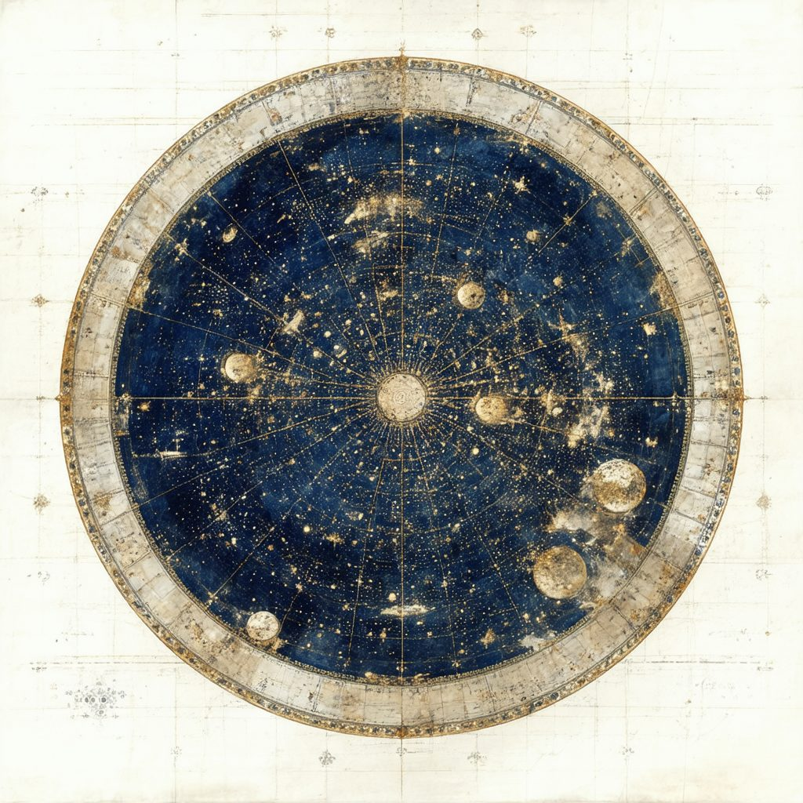
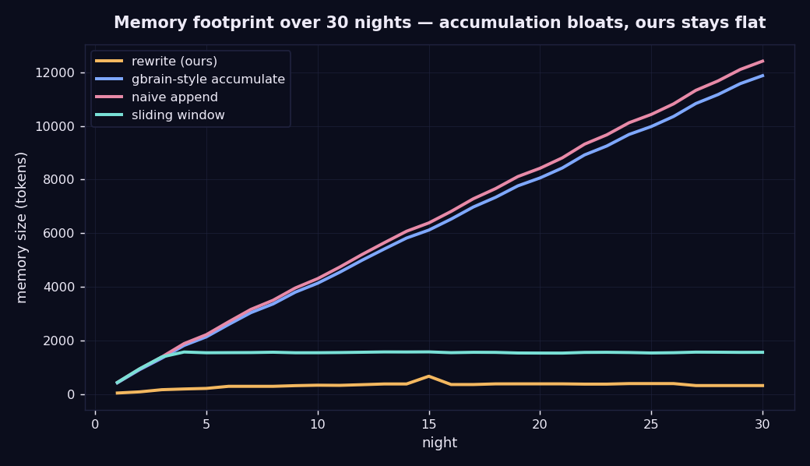
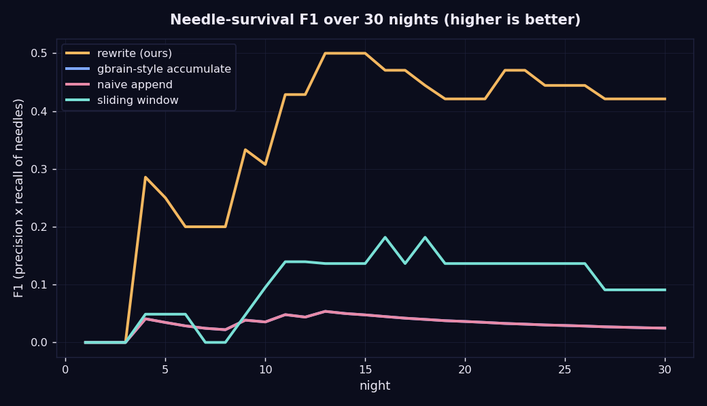
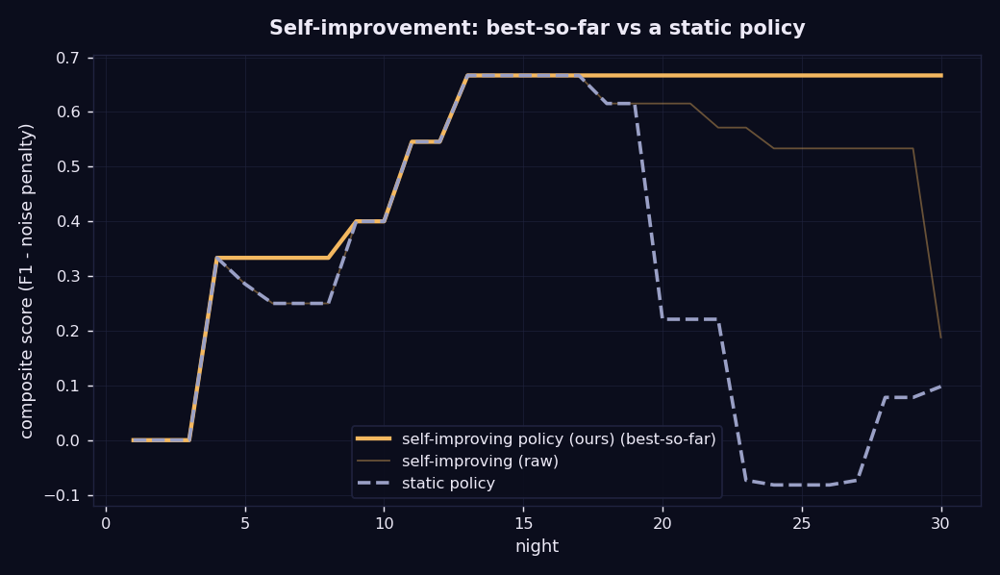
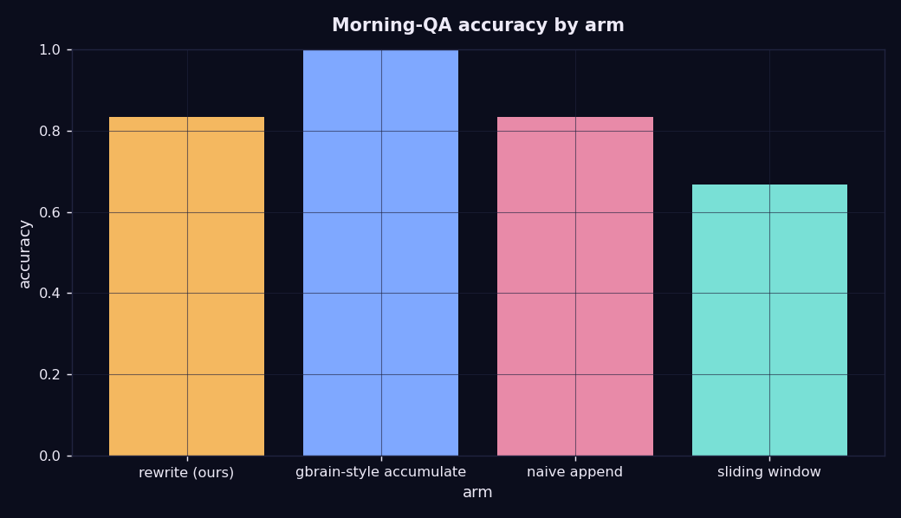

# nocturne

**A self-improving, sleep-time research agent that rewrites what it knows *and* how it thinks — overnight — and gets measurably better at being you each night.**

> Two-level sleep-time compute: the same structured-rewrite primitive (`add` / `merge` / `reweight` / `drop`) runs on **episodic memory** (what I know) *and* on the agent's **own operating policy** (how I decide what's worth knowing).

---

## TL;DR

While you sleep, nocturne pulls your day's signals (papers, mail, calendar, Slack, GitHub, notes), and instead of *appending* everything to an ever-growing store, it **consolidates** a small, bounded working memory: merging evidence, reconciling contradictions, forgetting what's resolved, and surfacing latent cross-thread insights. Each morning it grades its own briefing against what actually mattered and **rewrites its own policy** so tomorrow's consolidation is sharper.

nocturne is not a competitor to a knowledge base like **GBrain** — it's the missing **working-memory / executive layer** that sits *on top* of one. GBrain-style systems are long-term memory: never forget, retrieve-and-synthesize on demand, and (by their own design) *surface* conflicting facts for you to resolve. nocturne is the bounded layer that holds only what matters for *tomorrow*, **reconciles** contradictions to a single current truth, acts **proactively** (a morning briefing, with no query), and **rewrites its own policy** from feedback.

The central question we test: **for a daily working set, does bounded consolidation + reconciliation beat accumulation?** We compare against a faithful, retrieval-based GBrain analog and find a clean, *fair* result: ours keeps a tiny store, **reconciles** a mid-stream contradiction that the never-forget arm retrieves *stale*, and **self-improves** over the month — while accumulation wins long-tail recall (the trade we deliberately make).

This is a CS 153 final project ("The One-Person Frontier Lab").

---

## Why (problem & insight)

Most agent "memory" appends. **GBrain** (Garry Tan / YC, open-sourced Apr 2026) is the flagship of that bet: a never-forget, markdown-first, self-wiring knowledge graph; its production instance holds 146k+ pages, and it answers by **retrieving the top ~20–40 relevant pages and synthesizing** a cited answer. We read its source to be fair to it — it is a genuinely strong long-term-memory system, and we do **not** claim to beat it at what it's for.

nocturne asks a different question and occupies a different layer: **"what is the *smallest* memory that still makes me effective tomorrow?"** Working memory, not a library. Four things follow that GBrain by design does *not* do — confirmed from its code:

| | GBrain (long-term memory) | nocturne (working memory) |
|---|---|---|
| Footprint | never forget (146k+ pages) | bounded under a hard token budget; active forgetting (`drop` + decay) |
| Contradictions | *surfaces both* ("never silently pick one") | **reconciles** to the current truth (drops the stale one) |
| Interaction | **pull** — you query it | **push** — proactive briefing, no query |
| Adaptation | fixed pipeline | **rewrites its own operating policy** from graded feedback |

These aren't "a worse GBrain" — they're a different organ (working memory + executive function vs. long-term store). They're **complementary**: nocturne is exactly the kind of bounded layer that could sit on top of a GBrain library (Q4 / roadmap). We build on **sleep-time compute** (Lin et al., arXiv:2504.13171) and **Reflexion** (arXiv:2303.11366); the novel move is one rewrite primitive at *two levels* (memory + policy) plus reconciliation and proactivity.

---

## The motif — a constellation is meaning drawn from chaos



The whole project is grounded in **baroque celestial cartography** — Andreas Cellarius's *Harmonia Macrocosmica* (1660) and the era's star atlases — because that *is* the thesis, not decoration. The night sky is an overwhelming field of stars (the raw signal stream). The astronomer working *through the night* doesn't catalog every star; they draw a few **constellations**: bounded, meaningful figures you steer by, remembered and passed down.

That is the difference nocturne draws out: **GBrain is the star *catalog*** — every point of light kept (146k pages), retrievable. **nocturne is the *constellation*** — the small figure you actually navigate by, charted overnight, with faint unmentioned stars allowed to fade. The dashboard's "two brains" panel makes it literal: a connected gold constellation beside an ever-denser blue catalog.

The art is **diffusion-generated** (`stable-diffusion-3.5-large` via DigitalOcean; see `viz/generate_art.py`) but used *only as atmosphere* — full-bleed nebula + parchment textures that cover-scale at any size. Every **structural and interactive element is procedural SVG** (the constellation, the two-brains star fields, the charts), so the UI never depends on an image fitting a layout.

## How it works

### The primitive, at two levels

```
            ┌──────────────────────────────────────────────────────────┐
            │            structured rewrite ops                         │
            │      add · merge · reweight · drop  (src/nocturne/ops.py) │
            └───────────────┬───────────────────────┬──────────────────┘
                            │                        │
                  Level 1: memory            Level 2: policy
              (what I know)              (how I decide what to keep)
              MemoryStore                PolicyStore
              bounded · decays           directives the agent
              · provenance · budget      writes for its future self
```

`ops.py` is shared by both `MemoryStore` and `PolicyStore` — "one primitive, two levels" is literally true in the code, not a metaphor.

### A night, end to end

```
 sources ─▶ LIGHT (triage) ─▶ DEEP (consolidate: merge/reweight/drop) ─▶ REM (cross-thread synthesis)
                                        │                                      │
                                  bounded memory                       hypothesis ledger
                                        │                                      │
 morning ─▶ proactive briefing  ◀───────┴──────────────────────────────────────┘
        ─▶ judge vs ground truth ─▶ critique ─▶ SELF-IMPROVE (rewrite the policy)
                                                   validation-gated hill-climb (keep-best + rollback)
```

Key mechanisms (all in `src/nocturne/`): **provenance** (every memory item links to the raw items that produced it), a **hard token budget** that forces real tradeoffs, **Ebbinghaus decay + reinforcement**, **conflict reconciliation**, a confidence-scored **hypothesis ledger** (REM promotes an insight only when confirming evidence arrives), and **proactive briefings** (drafts + nudges).

---

## Data (methods note — please read)

The 30-day stream is a **simulated environment**, not a real inbox. We built a story-shaped, **ground-truth-labeled** life-stream generator (`src/nocturne/sim/`) so the system is reproducible and testable at a scale that would take a month to collect live. The labels (which item is a needle, which thread it belongs to, which is noise) are authored from the skeleton script **independently of the item bodies**, which keeps the evaluation non-circular.

**The inputs are simulated; the cognition is real.** Every consolidation, reconciliation, REM synthesis, self-improvement edit, and QA answer is produced by a real model via the DigitalOcean inference API — all arms see the identical stream, so results turn on real reasoning, not authored endings. The trace is frozen at `src/nocturne/sim/traces/world_30d.json`.

The trace encodes deliberate shapes: a rebuttal spine (stays hot), a collaboration that fizzles (must fade), a lab-meeting time that changes (must reconcile), a recurring paper-saving habit (must be inferred as a preference), pure noise (must be ignored), and a **planted latent insight** (a paper on night 6 + an experiment anomaly on night 13 → a synthesis the agent should surface, confirmed by new data on night 22).

---

## Results

Run on **DigitalOcean serverless inference** — tiered **gpt-oss-20b** (bulk cycles) + **gpt-oss-120b** (REM synthesis) — over the 30-night trace, **5 seeds** (mean±std). Full numbers + charts: [`results.md`](results.md), [`artifacts/`](artifacts/), and `runs/batch/summary.json`.

**A fair comparison.** We separate two costs so we don't strawman the library: **store** (everything an arm holds) vs **query** (the context actually used to answer). The GBrain arm keeps everything *and* answers by **retrieving the top-K relevant pages** — so its query cost is bounded, exactly like the real system. We do not claim a query-token win.

| arm | store | avg query | needle F1 | lab-meeting contradiction |
|---|---|---|---|---|
| **rewrite (ours)** | **~325 tok** | bounded (whole memory) | **0.64 ± 0.10** | ✅ **reconciled to current truth** |
| gbrain_accumulate (retrieval) | ~12k tok, grows | bounded (top-K) | 0.03 | ❌ retrieves the **stale** fact |
| naive append | ~12k tok | full dump | 0.03 | ❌ |
| sliding window | ~1.5k tok | bounded | 0.09 | ✅ but forgets old facts (recall 0.50) |

**What actually differs (the fair wins):**
1. **Contradiction reconciliation.** When the lab meeting moves (night 11), ours drops the stale time and holds the current one; the never-forget arm retrieves the *old* one. This is by design on both sides — GBrain's synthesis prompt says "surface BOTH… never silently pick one."
2. **Self-improvement.** Best-so-far composite score **0.67 ± 0.07** vs a static policy **0.29 ± 0.16** — the agent teaches itself directives (e.g. drop promotional mail, retain deadlines) that GBrain has no mechanism for.
3. **Compact, self-curating store** with zero retained noise, vs an unbounded library that needs a retrieval+rerank layer (GBrain's own benchmark: P@5 ≈ 0.49).
4. **Proactivity** — a morning briefing with no query.
**Where accumulation wins (the trade we make):** long-tail recall of arbitrary facts. nocturne deliberately forgets to stay sharp; that's the bet.

> _Reproducibility note: artifacts on `main` are rendered with the deterministic `--offline` engine so the repo runs out of the box. The real tiered-DO multi-seed numbers + ablations live on the `overnight-results` branch._

Charts (committed to `artifacts/`):






**Self-improvement** — the self-improving policy's best-so-far score climbs over the month while a static policy stays flat; the agent's *learned directives* are legible (e.g. "drop promotional/recruiter chatter," "retain deadline + advisor items," "consolidate same-thread items"). **Planted insight** — surfaced as an open hypothesis on night 13 and **confirmed** when the night-22 evidence lands.

### The time-machine dashboard

`artifacts/dashboard.html` is a **single self-contained file** (no server, no network) — scrub all 30 nights and watch the memory **constellation**, the morning briefing, the hypothesis ledger (open → confirmed), the self-rewritten policy, and the eval charts evolve. Open it directly in a browser.

---

## Quickstart

```bash
uv venv && source .venv/bin/activate          # or: python3.11+ -m venv .venv
uv pip install -e ".[dev]"                     # or: pip install -e ".[dev]"

# zero-setup: replay the committed live run (no key needed) -> charts + dashboard
python -m nocturne.run eval --do-replay
open artifacts/dashboard.html

# run it for real on DigitalOcean inference (OpenAI-compatible)
cp .env.example .env                           # set OPENAI_BASE_URL / OPENAI_API_KEY / OPENAI_MODEL
python -m nocturne.run eval --do

# watch a few nights unfold in the terminal
python -m nocturne.run demo --nights 12 --do-replay

pytest -q                                       # deterministic test suite (no network)
```

Engines: `--do` (real DigitalOcean model, records cassettes) · `--do-replay` (replay committed cassettes, no key) · `--offline` (transparent heuristic engine for environments with no key — explicitly *not* the model; see Limitations).

---

## Repository layout

```
src/nocturne/
  ops.py            shared rewrite primitive (add/merge/reweight/drop) — used by both stores
  memory/           MemoryStore (provenance, token budget, conflict) + decay.py (Ebbinghaus)
  policy/           PolicyStore — the self-rewritten operating policy
  agent/            prompts, rewrite (deep consolidate), rem, improve, qa, baselines
  hypotheses/       confidence-scored insight ledger
  sim/              the simulation environment + frozen world_30d.json (DATA)
  eval/             metrics, judge, harness (both experiments), report
  viz/              matplotlib charts + the self-contained dashboard
  openai_compat.py  DigitalOcean (OpenAI-compatible) engine
  llm.py            Anthropic engine (optional) + caching + record/replay
  run.py            CLI: sim | eval | demo | dashboard
tests/              deterministic FakeLLM end-to-end + unit tests
artifacts/          committed charts + dashboard.html
runs/               committed run bundle + cassettes (for --do-replay)
docs/VIDEO_SCRIPT.md
```

## Evaluation methodology

Two experiments, both on the fixed labeled trace:
1. **Brains comparison** — rewrite (ours) vs gbrain_accumulate (never-forget + top-K retrieval, the fair GBrain analog) vs naive append vs sliding window. We track **store tokens** and **query tokens** separately so the retrieval arm isn't strawmanned. Metrics: needle-survival precision/recall/F1, noise leakage, morning-QA accuracy, and per-question correctness (incl. the night-11 contradiction). Baselines are mechanical; ours uses LLM consolidation; every arm answers the same questions with the same model from its own memory (full bounded memory for ours, retrieved top-K for the library arm).
2. **Self-improvement** — self-improving policy vs static policy; composite score over nights, with a validation-gated hill-climb (best-so-far is monotonic by construction; we also report raw score and the static control).

## Limitations & failure analysis

- **The GBrain arm is an *analog*, not GBrain.** We read GBrain's source and modeled its core posture — never-forget storage + top-K retrieval + synthesize. Our retrieval is lexical top-K, not GBrain's hybrid vector+keyword+typed-graph stack with reranking, and we don't reimplement its entity graph, gap analysis, or multi-user scoping. So we compare against the *philosophy* (accumulate + retrieve), not the product, and we don't claim to beat GBrain at long-term memory — only that bounded reconciliation behaves differently (and better) for a daily working set.
- **Accumulation wins long-tail recall.** Our bounded store forgets by design; a never-forget library will answer arbitrary old questions ours can't. That's the explicit trade.
- **Best-so-far framing.** The self-improvement headline curve is monotonic by design (validation-gating). We disclose it and also plot the raw score + a static-policy control.
- **Simulated inputs.** The stream is synthetic (disclosed above); the cognition is real, but real inboxes are messier than a story-shaped trace.
- **Offline engine ≠ model.** `--offline` is a transparent heuristic stand-in for zero-setup reproducibility and deterministic tests; reported numbers come from `--do` (a real model on DigitalOcean). The bundle records which engine produced it.
- **Decay can drop a premise early.** A premise of the planted insight can fade before the payoff; the ledger handles this by confirming on the later evidence, but a more aggressive budget can lose needles (visible in the window arm).

## AI usage disclosure

This project was built with heavy AI assistance (Anthropic's Claude, via Claude Code), used for: scaffolding the package, writing the consolidation/REM/self-improvement prompts and the harness, building the dashboard, and drafting this README. All design decisions, the experiment design, and the integrity framing were directed by the author. The runtime system calls real models on **DigitalOcean serverless inference** for all nightly cognition (tiered `gpt-oss-20b` + `gpt-oss-120b`). The dashboard's atmospheric textures are **diffusion-generated** (`stable-diffusion-3.5-large`, see `viz/generate_art.py`); all structural/interactive UI is hand-written procedural SVG. The simulated dataset is disclosed in **Data** above. Sources are cited below.

## Citations & acknowledgements

- Lin et al., *Sleep-time Compute: Beyond Inference Scaling at Test-time* — arXiv:2504.13171 (Letta / Berkeley).
- Shinn et al., *Reflexion: Language Agents with Verbal Reinforcement Learning* — arXiv:2303.11366.
- Packer et al., *MemGPT: Towards LLMs as Operating Systems* — arXiv:2310.08560.
- **GBrain** (Garry Tan / YC), open-source agent memory — github.com/garrytan/gbrain — used as the named accumulation foil in our evaluation (design philosophy only; we do not repeat its contested benchmark numbers).
- Compute: **DigitalOcean Gradient serverless inference** (OpenAI-compatible).

## Roadmap

- Real OAuth source integrations (Gmail, Calendar, Slack, Linear) — run on real signals.
- Multi-seed eval with variance bars; a planted-needle adversarial-forgetting stress test.
- Learned relevance ranker from user accept/reject feedback on briefing items.
- Proactive drafts that send (with confirmation); deploy nightly via cron on DigitalOcean.
- **Complementary to GBrain:** nocturne as a bounded **working-memory / consolidation layer** on top of GBrain's bottomless **library** (via MCP) — they solve different halves of the problem.
